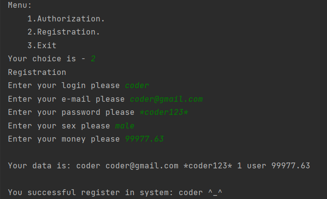
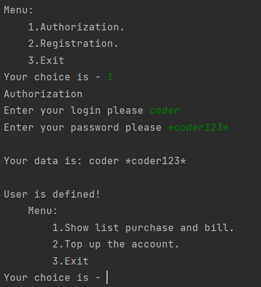
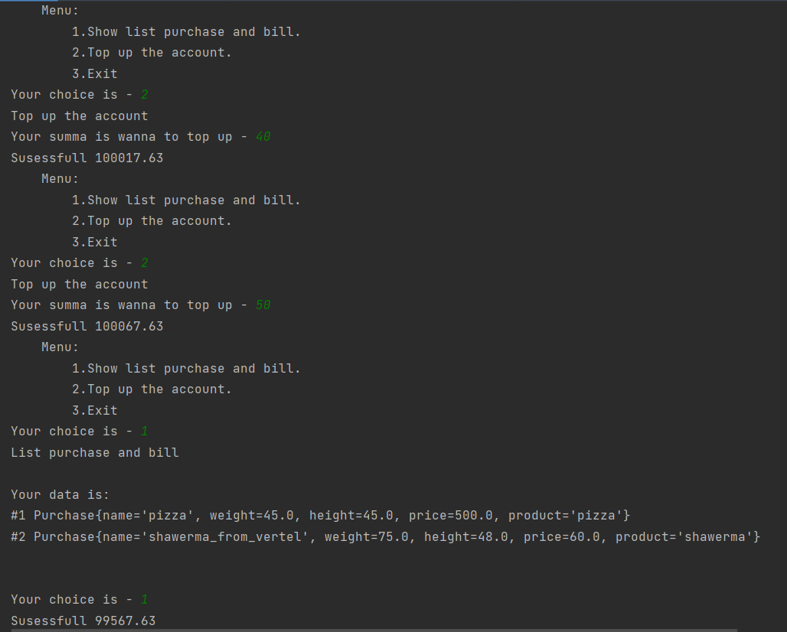
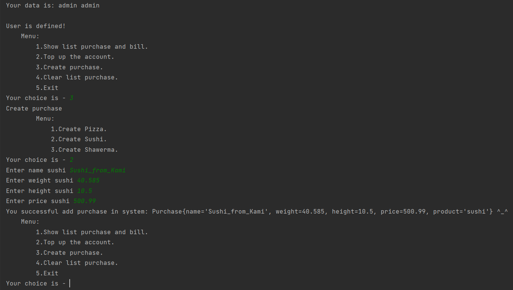
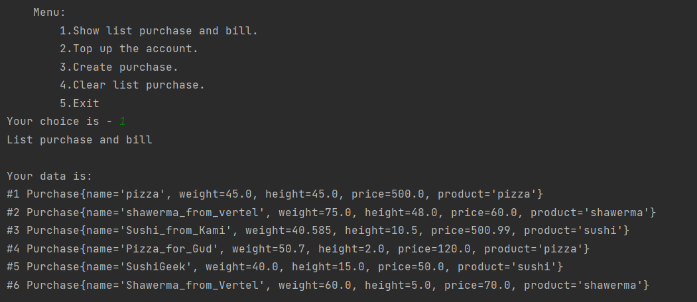

# Console-Simple-Shop
___

## Preview from dima-coder =)!
1. This project uses jdk 11.
2. My project implements a simple customer-cash system that is, a store.
3. Project uses console, without swing interface.
4. Project uses files to store information, not a database.

## Features
### Features for all (users and admin)
- Sing in/Log out
- Registration
- Show list purchase and bill
- Top up the account

### Additional features for admin
- Create purchase
- Clear list purchase

## Usage
You can generate user
```java
System.out.println("Registration");
try {
    new Registration(getData("Enter your login please "), getData("Enter your e-mail please "),
            getData("Enter your password please "), getData("Enter your sex please "),
            Double.parseDouble(Objects.requireNonNull(getData("Enter your money please ")))).start();
    } catch (Exception e) {
            System.out.println("Maybe you enter bad symbol in field");
}
```
You authorization in system
```java
System.out.println("Authorization");
try {
    Login l = new Login(getData("Enter your login please "), getData("Enter your password please "));
    l.start();
    while (true) {
        String role = checkUserRole(l.getLogin(), l.getPassword());
        if (role != null) {
            if (!menuAfterAuthorization(role, l.getLogin(), l.getPassword(), checkUserMoney(l.getLogin(), l.getPassword())))
                break;
        } else break;
    }
} catch (Exception e) {
    e.printStackTrace();
    System.out.println("Exception authorization!");
}
```
And you can also features referred to in paragraph Features.
<br>Data about users and purchase will be store into files in such as users.txt 
and purchase.txt.

## Photo
### Registration

### Authorization

### Features
#### Features user

#### Features admin (addition)

Also I ***add*** some ***purchase*** because I wanna to buy many things =)
<br>You can see in the next photo all ***list purchase***. 
<br>***Clear list*** - I think it's clear how it works.
